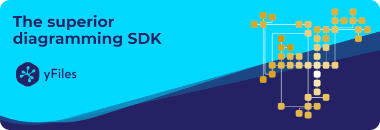

<!--
 //////////////////////////////////////////////////////////////////////////////
 // @license
 // This file is part of yFiles for HTML 2.5.0.3.
 // Use is subject to license terms.
 //
 // Copyright (c) 2000-2023 by yWorks GmbH, Vor dem Kreuzberg 28,
 // 72070 Tuebingen, Germany. All rights reserved.
 //
 //////////////////////////////////////////////////////////////////////////////
-->

# Welcome to yFiles for HTML 2.5.0.3

We recommend using the yFiles Dev Suite, which you can access the yFiles for HTML Dev Suite from the HTML Readme. The Dev Suite is a collection of tools that can assist you with many
tasks during development with yFiles for HTML.

## Getting started

### First-time setup

Learn about the prerequisites, running the demos, and how to get started if this is
your first time developing with yFiles.

- [Check the technical requirements](https://docs.yworks.com/yfileshtml/#/dguide/introduction-technical_requirements) for developing and deploying applications with yFiles for HTML.
- [Set up the contents of this package](https://docs.yworks.com/yfileshtml/#/dguide/getting_started#first-time-setup) in your project.
- [Start learning to develop](https://docs.yworks.com/yfileshtml/#/dguide/getting_started-ide) with yFiles for HTML.
- [Build your first own app](https://docs.yworks.com/yfileshtml/#/dguide/getting_started-application) with yFiles for HTML.
- [Read the Software License Agreement](https://www.yworks.com/products/yfiles-for-html/sla)

## Demos and tutorials

yFiles for HTML ships with a number of source code demos and tutorials. Please note that you need [start the demo server](https://docs.yworks.com/yfileshtml/#/dguide/getting_started#first-time-setup) to run the demos **locally**.

- Source Code Demos: [Local](http://localhost:4242/demos-ts/README.html) - [Online](https://live.yworks.com/)
- Getting Started Source Code Tutorial: [Local](http://localhost:4242/demos-js/README.html#tutorial-getting-started) - [Online](https://live.yworks.com/demos/#tutorial-getting-started)
- Application Features Source Code Tutorial: [Local](http://localhost:4242/demos-js/README.html#tutorial-application-features) - [Online](https://live.yworks.com/demos/#tutorial-application-features)

## Documentation & help

yFiles for HTML ships with comprehensive documentation and video tutorials:

### Documentation

- [API Documentation](https://docs.yworks.com/yfileshtml/)
- [Getting Started Developer's Guide Chapter](https://docs.yworks.com/yfileshtml/#/dguide/getting_started)

### yFiles videos

- [Video Tutorials on YouTube](https://youtube.com/yWorksTube)
- [Webinars and screencasts](https://www.yworks.com/services/webinars)

### yWorks support

If you have read the documentation and are still stuck, feel free to [contact our support team](https://www.yworks.com/products/yfiles/support).

## Returning Developers

If you are a returning developer or migrating from another yFiles product or version, the following might be of interest to you:

- [Changes](https://www.yworks.com/products/yfiles-for-html/changelog) between earlier versions and this one.
- [Migration Guide](https://docs.yworks.com/yfileshtml/#/dguide/migration) from earlier versions to this one.
- [Known issues](https://docs.yworks.com/yfileshtml/#/dguide/known_issues) in the current release.

## License and redistribution information

This evaluation version of yFiles for HTML is for evaluation purposes only.
You are not entitled to distribute any of the files included in this evaluation
version of yFiles for HTML as part of your software or otherwise.

The files in the directory `lib` are the Redistributables as mentioned in Section 2 in the
[license terms](http://localhost:4242/doc/readme/legal/SOFTWARE_LICENSE_AGREEMENT.html).

Licensees of a regular/non-eval version of yFiles for HTML are entitled to deliver
Redistributable(s) as part of their own software applications as specified in the
corresponding [Software License Agreement](http://localhost:4242/doc/readme/legal/SOFTWARE_LICENSE_AGREEMENT.html).

### Third party code and licenses

Neither the Redistributable(s) of yFiles for HTML nor the included demos contain any third-party libraries or code.

### yFiles license mechanism for app distribution

Apart from the abovementioned Redistributable(s), in order to run, a yFiles for HTML application needs a valid license.

Evaluation versions of yFiles for HTML come with a pre-generated evaluation license file that is located in lib/license.json. You can include this file in any HTML page that uses the library.

See the Licensing section in the Developer's Guide for additional information.

## Contact

[Help and support](https://www.yworks.com/products/yfiles/support).

yWorks GmbH, Vor dem Kreuzberg 28, 72070 Tuebingen, Germany

Phone: +49 7071 979050

Email: contact@yworks.com
